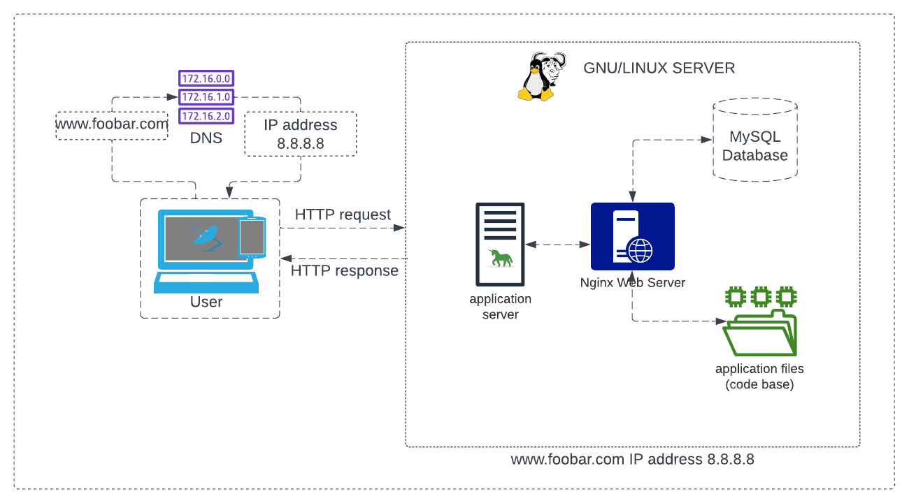
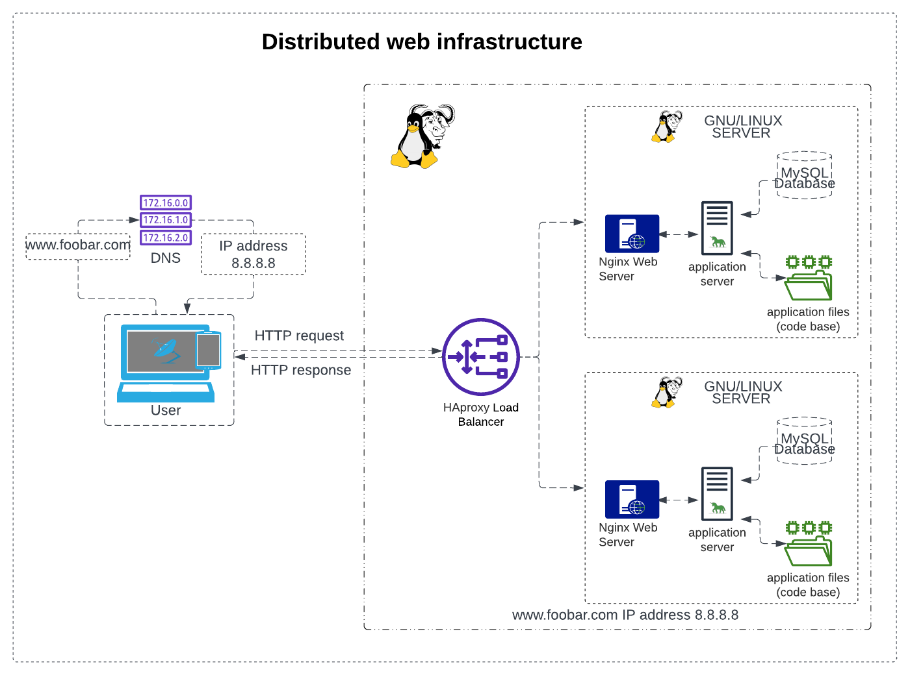
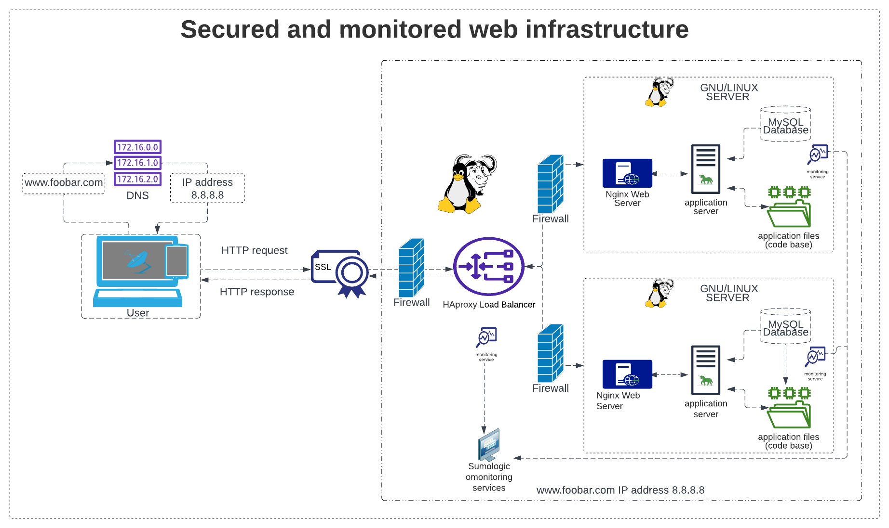

#  Web infrastructure design
DevOps SysAdmin web infrastructure

Concepts
For this project, I am expected to know these concepts:

- DNS
- Monitoring
- Web Server
- Network basics
- Load balancer
- Server

# Simple web stack

## About
First, user wanting to access the website hosted on this infrastructure. When a user types www.foobar.com in their web browser, their computer sends a request to the domain name system (DNS) server to resolve the domain name into an IP address. The DNS server then returns the IP address of the server that is hosting the website.

In this case, the DNS server returns the IP address 8.8.8.8, which is the IP address of our server. The user's computer then establishes a connection with the server using HTTP protocol to request the website content.

## components of the infrastructure:

### Server: 
A server is a computer that provides services or resources to other computers over a network. In this case, our server hosts the website content and serves it to users who request it.

### Domain name:
A domain name is a human-readable name that represents an IP address on the internet. It makes it easier for users to remember and access websites. In this case, the domain name is foobar.com, and it is configured with a www record that points to our server's IP address.

### DNS record:
The www record is a DNS record that is used to associate a domain name with a specific host or server. In this case, the www record is associated with our server's IP address, so when users type www.foobar.com, the DNS server returns our server's IP address.

### Web server:
A web server is a software that runs on the server and handles incoming HTTP requests from users' web browsers. In this infrastructure, we use Nginx as our web server.

### Application server:
An application server is a software that runs on the server and handles the application logic and business rules of a web application. In this infrastructure, we use gnu unicorn as our application server to execute our code base.

### Application files:
The application files are the code base of our web application that contains the logic and functionality of the website. In this infrastructure, the application files are stored on the server and executed by the application server.

### Database:
A database is a software that stores and manages data for web applications. In this infrastructure, we use MySQL as our database to store and manage our website data.

## Issues with this infrastructure:

### SPOF:
The infrastructure has a single point of failure (SPOF), which means that if the server goes down, the entire website becomes inaccessible.

### Downtime during maintenance:
Whenever we need to deploy new code or perform maintenance on the web server, we need to restart the web server, which results in downtime for the website.

### Scalability:
The infrastructure cannot scale if we receive a large amount of incoming traffic. As the traffic increases, the server will not be able to handle it, resulting in slow website performance or downtime.

To overcome these issues, we can consider adding more servers, load balancers, and other scaling techniques. We can also use caching mechanisms and content delivery networks (CDNs) to improve website performance and reduce server load.

# Distributed web infrastructure

A three-server web infrastructure that hosts the website www.foobar.com, we would need to add two servers to the existing setup. The following are the details of the infrastructure:

### Web Server:
The web server (Nginx) is responsible for serving static content and handling HTTP requests from the users. It listens for incoming requests and routes them to the appropriate application server.

### Application Server:
The application server is responsible for handling dynamic content and running the codebase. It receives requests from the web server, processes them, and sends the response back to the web server.

### Load Balancer:
The load balancer (HAproxy) is responsible for distributing incoming requests evenly across the two application servers. It is configured with a round-robin distribution algorithm, which works by sending each request to the next available server in a circular order.

### Database:
The database (MySQL) stores and retrieves data for the application. It is configured with a Primary-Replica (Master-Slave) cluster, which works by having one Primary node that accepts read-write requests and one or more Replica nodes that accept read-only requests. The Primary node is responsible for handling all write requests and synchronizing the data with the Replica nodes.

### Application Files:
This contains the codebase for the application that is being hosted.

The load balancer to distribute incoming traffic across multiple application servers, improving performance and reducing the chances of downtime due to a single point of failure (SPOF). The load balancer is configured with a round-robin algorithm to evenly distribute the traffic.

### Active-Active or Active-Passive setup
The load balancer is enabling an Active-Active setup, where both application servers are active and can handle incoming traffic. In contrast, an Active-Passive setup would have one server as the primary server and the other server as the backup. In case the primary server fails, the backup server would take over. However, this can result in lower performance as only one server is active at a time.

### Primary-Replica (Master-Slave)
The database Primary-Replica (Master-Slave) cluster works by having the Primary node accept read-write requests and synchronize the data with the Replica nodes. The Replica nodes can handle read-only requests and provide redundancy in case the Primary node fails. However, there can be a delay in data replication between the Primary and Replica nodes, leading to potential data consistency issues.

The Primary node in the database cluster is responsible for handling all write requests and synchronizing the data with the Replica nodes. In contrast, the Replica nodes can only handle read-only requests and do not have the capability to make changes to the data. As a result, the Primary node is critical to the functioning of the application.

### Issues with this infrastructure
The issues with this infrastructure include the presence of SPOF, as the load balancer and database Primary node can become a single point of failure. Security issues can also arise due to the lack of a firewall and HTTPS implementation. Additionally, there is no monitoring in place to ensure that the infrastructure is functioning correctly and to detect and address any issues that arise.

#  Secured and monitored web infrastructure

A three server web infrastructure that hosts the website www.foobar.com, is secured, serves encrypted traffic, and is monitored, we will add:

### Three firewalls:
We are adding firewalls to the infrastructure to provide security by controlling and monitoring incoming and outgoing traffic.

### SSL Certificate
An SSL certificate to serve www.foobar.com over HTTPS: We are adding an SSL certificate to encrypt the traffic between the server and the user, providing secure communication.

### Three monitoring clients:
We are adding monitoring clients to the infrastructure to monitor the health and performance of the servers and applications, detect issues and troubleshoot them before they impact the users.

## Specifics about this infrastructure:

### Firewalls:
Firewalls are network security systems that monitor and control incoming and outgoing traffic based on predefined security rules. They provide protection against malicious attacks, unauthorized access, and data theft.

### HTTPS:
HTTPS (Hyper Text Transfer Protocol Secure) is a protocol used to secure communication over the internet by encrypting the traffic between the server and the user. HTTPS uses SSL/TLS certificates to establish a secure connection between the client and the server.

### Monitoring:
Monitoring is the process of collecting and analyzing data from various sources to ensure the health and performance of the infrastructure, applications, and services. It helps detect issues, troubleshoot them, and prevent downtime and data loss.

#### Monitoring tool:
The monitoring tool used should be capable of collecting data from various sources, such as logs, metrics, and events. It should also provide visualization, alerting, and analysis capabilities to help administrators detect issues and troubleshoot them.

#### Monitoring QPS: 
To monitor the web server QPS (Queries Per Second), we can use monitoring tools like Prometheus or Grafana that collect metrics data and visualize it in dashboards. We can set up alerts to notify administrators when QPS exceeds a certain threshold.

## Issues with this infrastructure:

Terminating SSL at the load balancer level can be an issue as it can expose sensitive data to potential attacks. It is recommended to use end-to-end encryption with SSL certificates at the web server level.

Having only one MySQL server capable of accepting writes can be an issue as it can lead to a single point of failure. It is recommended to set up a MySQL cluster with Primary-Replica (Master-Slave) nodes to ensure high availability and data redundancy.

Having servers with all the same components (database, web server, and application server) can be a problem as it can lead to a single point of failure. It is recommended to use load balancers and multiple servers to ensure high availability and redundancy.